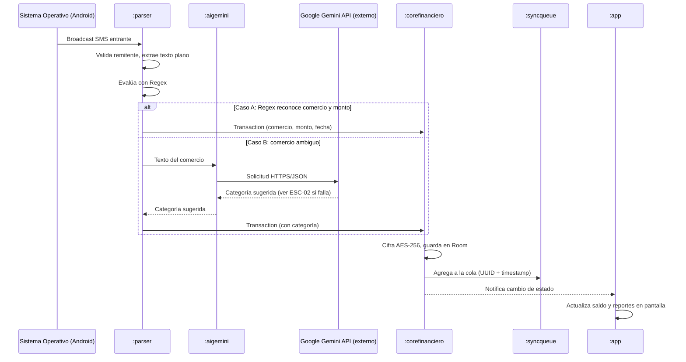
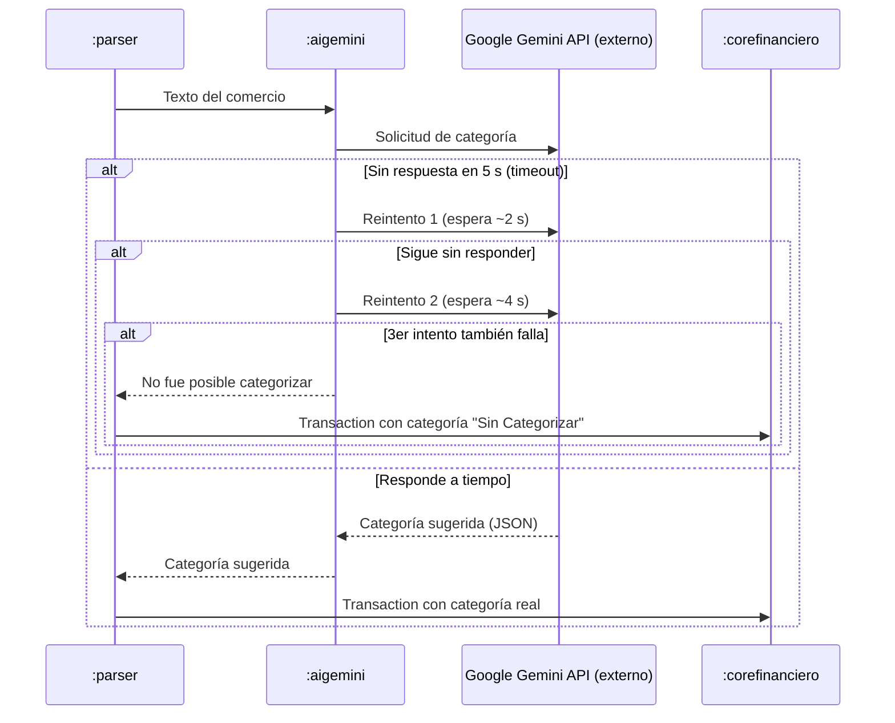
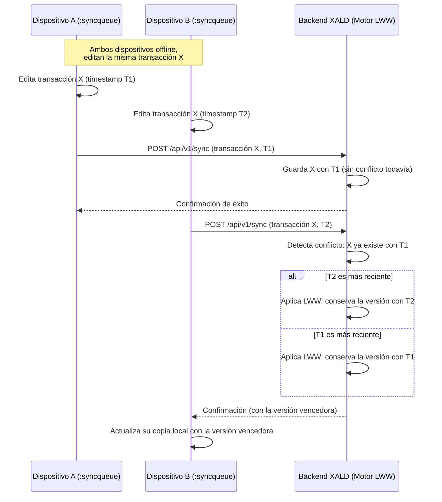
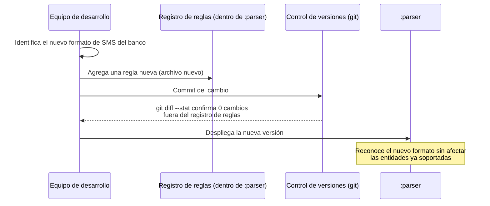
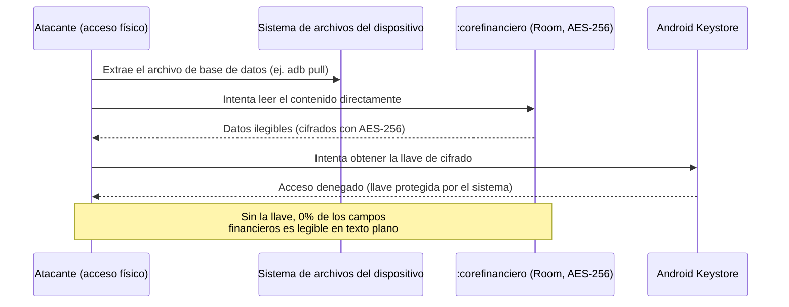

# Runtime View

Esta sección muestra, para cada uno de los 5 escenarios de calidad definidos en la Sección 10 (ESC-01 a ESC-05), cómo interactúan los módulos reales de XALD durante su ejecución. Los nombres usados corresponden a los módulos Gradle del proyecto (ver Sección 5): `:parser`, `:aigemini`, `:corefinanciero`, `:syncqueue` y `:app`. Cada escenario incluye un diagrama de secuencia UML (formato Mermaid, renderizado automáticamente por GitHub) además de la descripción paso a paso.

## 6.1 Runtime Scenario 1 — Captura, Parsing e Inferencia Automática de SMS (verifica ESC-01)

**Motivación:** este es el flujo central del módulo A-01: describe cómo XALD convierte un SMS bancario en una transacción financiera guardada, sin que el usuario tenga que hacer nada, incluso sin conexión a internet.

**Pasos del escenario:**

1. **Recepción del evento:** el sistema operativo Android recibe un SMS del banco y activa el BroadcastReceiver del módulo `:parser`.
2. **Filtrado:** `:parser` valida el remitente y extrae el texto plano.
3. **Parsing local (Regex):** `:parser` evalúa el texto con expresiones regulares. **Caso A (Regex exitoso):** si reconoce el comercio y el monto, genera directamente el objeto `Transaction`. **Caso B (comercio ambiguo):** envía el texto al módulo `:aigemini`, que a su vez consulta la Gemini API externa; si falla o no responde, este caso se resuelve según el flujo detallado en el **Escenario 2 (ESC-02)**.
4. **Persistencia local:** el objeto `Transaction` se envía a `:corefinanciero`, que cifra los campos con AES-256 y guarda la fila en la base de datos local (Room).
5. **Encolado para sincronización:** `:corefinanciero` notifica a `:syncqueue`, que agrega el registro a la cola de sincronización con su UUID y timestamp.
6. **Notificación a la UI:** `:corefinanciero` notifica el cambio a `:app`, que actualiza el saldo y el reporte en pantalla. *(el mecanismo exacto de notificación — StateFlow, LiveData u otro — está pendiente de confirmar contra la implementación real de `:app`)*.

**Aspectos notables:** la IA nunca bloquea el flujo — solo interviene en el Caso B, y aun así el resultado se integra al mismo camino de persistencia que el Caso A. Esto es lo que le da a XALD su característica de captura rápida y no bloqueante.

---

## 6.2 Runtime Scenario 2 — Indisponibilidad del Servicio de Categorización (verifica ESC-02)

**Motivación:** este escenario detalla qué pasa exactamente cuando la Gemini API falla, algo que en el Escenario 1 solo se mencionaba de forma general. Los tiempos de espera y el número de reintentos vienen de la medida ya definida en la Sección 10 (umbral de 5 s, máximo 3 reintentos con espera creciente, 0 transacciones perdidas); la reclasificación posterior todavía no está implementada como componente y se describe por separado, sin diagramarla como un flujo ya existente.

**Pasos del escenario:**

1. `:aigemini` envía la solicitud de categoría a la Gemini API.
2. Si no hay respuesta en **5 segundos**, se reintenta con espera creciente (propuesta: ~2 s, luego ~4 s).
3. Si los 3 intentos fallan, `:aigemini` devuelve a `:parser` que no fue posible categorizar, y la transacción se guarda igual en `:corefinanciero` con la categoría **"Sin Categorizar"** — nunca se bloquea ni se pierde el registro.

> **Nota — extensión pendiente de implementar:** la reclasificación automática de transacciones "Sin Categorizar" cuando el servicio vuelve a responder requiere un componente (por ejemplo, un `Worker` periódico dentro de `:syncqueue` o `:aigemini`) que **todavía no está instanciado en el código**. Este diagrama solo cubre el flujo de captura inicial; la reclasificación queda pendiente de diseño e implementación, y no se representa aquí como si ya existiera.

**Aspectos notables:** el diseño garantiza el umbral de "0 transacciones perdidas" porque el registro nunca depende de que la IA responda — la categorización es un enriquecimiento posterior, no un requisito para guardar el gasto.

---

## 6.3 Runtime Scenario 3 — Resolución de Conflictos al Sincronizar (verifica ESC-05)

**Motivación:** este escenario extiende el flujo general de sincronización al caso específico de la Sección 10: el mismo usuario edita la misma transacción en dos dispositivos distintos mientras ambos están sin conexión.

**Pasos del escenario:**

1. El Dispositivo A y el Dispositivo B editan la misma transacción mientras ambos están offline, cada uno con su propio timestamp, gestionado por su propio módulo `:syncqueue` local.
2. El Dispositivo A recupera la conexión primero y su `:syncqueue` sincroniza la transacción con el Backend XALD; como no hay nada más registrado todavía, se guarda sin conflicto.
3. El Dispositivo B recupera la conexión después y su `:syncqueue` envía su propia versión de la misma transacción.
4. El Backend XALD detecta que ya existe un registro previo y aplica **Last-Write-Wins (LWW)**: compara los timestamps y conserva la versión más reciente.
5. El dispositivo cuya versión no ganó actualiza su copia local con la versión vencedora, para que ambos dispositivos queden consistentes.

**Aspectos notables:** este es el escenario de mayor riesgo técnico del árbol de utilidad (Riesgo: Alta), porque depende de que los relojes de ambos dispositivos sean razonablemente confiables para que LWW elija correctamente.

---

## 6.4 Runtime Scenario 4 — Incorporación de una Nueva Entidad Bancaria (verifica ESC-03)

**Motivación:** a diferencia de los escenarios anteriores, este no ocurre en producción sino en tiempo de desarrollo — describe cómo el equipo agrega soporte para un banco nuevo sin modificar el código de los bancos ya soportados (objetivo de Modificabilidad).

**Pasos del escenario:**

1. El equipo de desarrollo identifica el formato de SMS de una entidad bancaria no soportada.
2. Se agrega **un archivo nuevo** al registro de reglas dentro del módulo `:parser`, sin tocar los archivos de las entidades ya soportadas.
3. Se hace commit del cambio; `git diff --stat` confirma que solo se modificó el registro de reglas (0 cambios fuera de él).
4. Se despliega la nueva versión del módulo `:parser`.
5. A partir de ese momento, `:parser` reconoce el nuevo formato sin afectar el comportamiento de los bancos existentes.

**Aspectos notables:** este escenario es el que justifica directamente la decisión del ADR-0002 (Parsing Híbrido) — la separación en un registro de reglas dentro de `:parser` es lo que hace posible este bajo esfuerzo de modificación (≤ 4 h, según la medida de ESC-03).

---

## 6.5 Runtime Scenario 5 — Protección de Datos Almacenados ante Acceso No Autorizado (verifica ESC-04)

**Motivación:** este escenario describe qué pasa si alguien obtiene acceso físico al dispositivo (perdido o robado) e intenta leer la información financiera directamente del almacenamiento.

**Pasos del escenario:**

1. Un atacante con acceso físico extrae el archivo de base de datos del dispositivo (por ejemplo, con `adb pull`).
2. Intenta leer el contenido directamente con herramientas como `strings` o `sqlite3`.
3. El contenido resulta ilegible porque `:corefinanciero` lo cifra con AES-256.
4. El atacante intentaría obtener la llave de cifrado, pero esta vive en el Android Keystore, protegida por el hardware/cuenta del dispositivo y nunca se guarda junto a los datos.
5. Sin la llave, el 0% de los campos financieros es legible en texto plano.

**Aspectos notables:** este escenario verifica directamente la restricción RL-01 (Habeas Data) y RT-03 — la seguridad no depende de ocultar el archivo, sino de que sea inútil sin la llave, que es la práctica correcta de cifrado en reposo.
