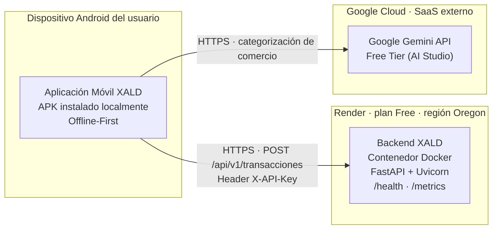

# Deployment View

Esta sección muestra dónde corre físicamente cada pieza del sistema XALD y qué costo mensual implica mantenerlas en línea, complementando la vista lógica de la Sección 5 (Building Block View) con la infraestructura real sobre la que se despliega cada contenedor.

## 7.1 Infraestructura de Despliegue

XALD se despliega sobre tres piezas de infraestructura independientes, una por cada contenedor o sistema externo identificado en el C1 y el C2:

| Pieza | Dónde corre | Cómo se despliega | Notas |
| :--- | :--- | :--- | :--- |
| **Aplicación Móvil XALD** (`:app`, `:parser`, `:corefinanciero`, `:syncqueue`, `:aigemini`) | Dispositivo Android del usuario | APK distribuido por GitHub Releases e instalado localmente ([ADR-0009](../adr/0009-distribucion-app.md)) | No requiere servidor: guarda primero en el dispositivo (Offline-First, RT-02). |
| **Backend XALD** | [Render](https://render.com), *Web Service* tipo Docker, plan **Free**, región **Oregon** | Definido como código en [`render.yaml`](../../render.yaml); imagen construida desde [`backend/Dockerfile`](../../backend/Dockerfile); desplegado por el job `deploy-backend` del CI mediante el secreto `RENDER_DEPLOY_HOOK` ([ADR-0008](../adr/0008-plataforma-de-despliegue.md)) | URL pública: `https://xald-backend.onrender.com`. Health check en `/health`, métricas en `/metrics` ([ADR-0010](../adr/0010-observabilidad.md)). `XALD_API_KEY` vive en Render → Environment, nunca en el repositorio. |
| **Google Gemini API** | Infraestructura de Google Cloud (SaaS, fuera de la frontera del sistema) | Consumida vía HTTPS desde `:aigemini` (`CategorizadorGemini`) con una llave de Google AI Studio, capa gratuita | Solo se envían el nombre del comercio y el monto (RL-01); si falla, aplica el flujo de reintentos de ESC-02. |

**Aspectos notables:** ninguna de las tres piezas requiere infraestructura administrada por el equipo, consecuencia directa de RO-01, RO-02 y RO-03.

**Estado actual:** el Backend XALD está desplegado y en línea. Las dos flechas que salen del dispositivo representan el diseño: la app todavía no llama al backend ni a Gemini (`CategorizadorGemini` es un *stub* local), por lo que esas conexiones se activan cuando se implementen los clientes HTTP de `:syncqueue` y `:aigemini`.

## 7.2 Costo Mensual

Estimación de costo bajo el supuesto de volumen indicado, con las tarifas vigentes en las fuentes citadas (consultadas el 27 de septiembre de 2026).

**Volumen supuesto:** 50 usuarios activos, cada uno generando en promedio 5 transacciones al día → **~7 500 transacciones al mes**, cada una sincronizada con el backend, y un número similar de posibles consultas a Gemini en el peor caso (todos los comercios ambiguos, ESC-01 Caso B), es decir **~250 consultas al día**.

| Pieza | Capa usada | Límite de la capa gratuita | Costo con el volumen supuesto | Fuente (fecha de consulta) |
| :--- | :--- | :--- | :--- | :--- |
| **Render** (Backend, Web Service Docker) | Free | 750 h/mes de instancia, 512 MB RAM, 0.1 CPU; se duerme tras 15 min sin tráfico | **$0/mes** — 7 500 peticiones al mes son un tráfico muy bajo para una instancia | [render.com/pricing](https://render.com/pricing) (27 sep 2026) |
| **Google Gemini API** (`:aigemini`) | Free Tier (Google AI Studio) | Del orden de cientos a ~1 500 solicitudes al día según el modelo Flash usado | **$0/mes** — ~250 solicitudes al día, dentro de la cuota de los modelos con mayor límite (ver punto de ruptura) | [ai.google.dev/gemini-api/docs/pricing](https://ai.google.dev/gemini-api/docs/pricing) y [ai.google.dev/gemini-api/docs/rate-limits](https://ai.google.dev/gemini-api/docs/rate-limits) (27 sep 2026) |
| **Aplicación Android** | GitHub Releases | Gratuito para repositorios públicos | **$0/mes** | — |
| **Total estimado** | | | **$0/mes** | |

**Punto de ruptura (cuándo deja de ser gratis):**

- **Render:** un servicio encendido todo el mes consume ~730 h, así que las 750 h gratuitas alcanzan para **una sola instancia**. La capa se rompe al agregar un segundo servicio o una segunda instancia para escalar, o cuando el tráfico exija más de 512 MB de RAM. El siguiente escalón es el plan **Starter** (~USD $7/mes).
- **Gemini API:** se rompe cuando las consultas diarias superan el límite del modelo gratuito. Con 5 transacciones por usuario al día, todas ambiguas, el punto de ruptura es **límite diario ÷ 5 usuarios**: con un modelo de ~1 500 solicitudes al día, unos **300 usuarios**; con un modelo de cuota menor, el supuesto de 50 usuarios puede quedar cerca del límite. A partir de ahí hay que habilitar facturación, que se cobra por token.
- Con el supuesto de 50 usuarios, Render queda lejos de su límite. Gemini es la pieza más sensible, y por eso la categorización es no bloqueante: si se agota la cuota, la transacción se guarda como *Sin Categorizar* (ESC-02) y no se pierde ningún registro.

> **Nota de trazabilidad:** `CategorizadorGemini` (`XALDAPP/aigemini/src/main/java/CategorizadorGemini.kt`) es un *stub* local que todavía no hace llamadas reales a Gemini. El costo de esa pieza es una proyección, no un gasto ya incurrido.
