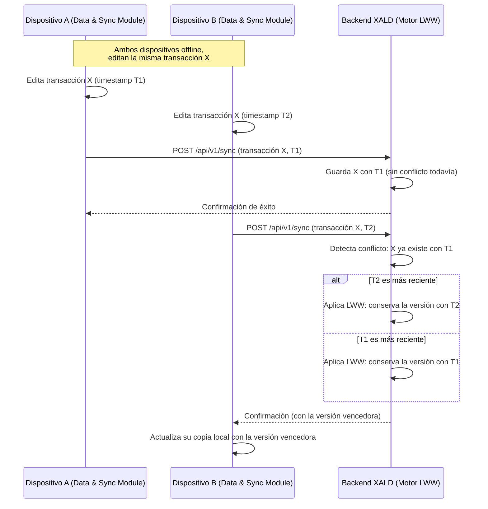
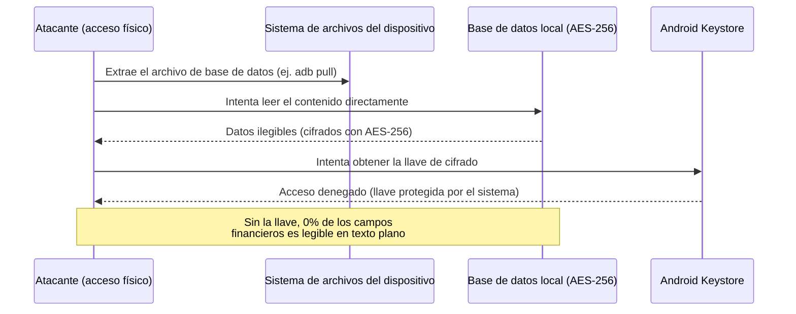

# Introduction and Goals 

Esta sección presenta una visión general de XALD: qué problema resuelve, cómo funciona, qué objetivos de negocio y de calidad persigue y quiénes son las partes interesadas. Sirve como punto de entrada para el resto de la documentación de arquitectura.

## Requirements Overview 

En la gestión financiera personal actual se identifican dos limitaciones estructurales que XALD busca resolver:

- **Fricción en la entrada de datos (carga cognitiva).** Anotar cada transacción a mano toma tiempo; al cabo de pocas semanas el usuario abandona la app, generando pérdida de integridad del historial financiero ("gastos hormiga" no registrados).
- **Dependencia estricta de conectividad (acoplamiento a red).** Si el usuario no tiene datos o la señal es mala, la mayoría de apps no abren o no permiten registrar nada.

**Solución propuesta:** una app móvil que registra los gastos con mínima intervención del usuario, leyendo automáticamente notificaciones/SMS bancarios o archivos CSV exportados del banco, y que funciona sin internet para mostrar la información al instante (offline-first).

**Cómo funciona el sistema (flujo de datos):** XALD funciona como una tubería de datos (pipeline) de 4 pasos:

1. **Captura:** vía SMS/notificación bancaria (leída automáticamente en segundo plano) o vía archivo CSV subido por el usuario.
2. **Validación y limpieza:** se extraen fecha, monto y comercio, verificando que los datos sean válidos.
3. **Categorización inteligente:** el nombre del comercio se envía a una API de IA (Gemini API, capa gratuita) que devuelve la categoría del gasto (ej. "Alimentación").
4. **Guardado local:** la transacción categorizada se persiste cifrada en el dispositivo (SQLite + SQLCipher, cifrado AES-256), visible al instante aunque no haya internet.

**Resiliencia:** si no hay internet o la IA no responde, el gasto se guarda igual bajo "Sin Categorizar" y se reclasifica automáticamente al volver la señal — nunca se pierde un dato. Las transacciones pendientes de sincronizar viven en una Sync Queue que garantiza orden cronológico exacto (timestamps/UUIDs) al reconectar, evitando duplicados o saldos sobrescritos.

## Business Goals

Los siguientes son los objetivos de negocio que justifican la existencia del sistema. Cada uno indica a qué interesado le importa y por qué. Los objetivos de calidad de la sección siguiente se derivan de estos.

| ID | Objetivo de negocio | Interesado principal | Por qué le importa |
|---|---|---|---|
| **OB-01** | Eliminar la fricción en la entrada de datos, que es la causa del abandono de la app y de la pérdida de integridad del historial financiero | Usuario final | Quiere el control de sus gastos sin dedicar tiempo diario a registrarlos a mano |
| **OB-02** | Desacoplar la aplicación de la conectividad, de modo que sea utilizable con o sin señal | Usuario final | Registra y consulta gastos en zonas sin cobertura o con datos agotados |
| **OB-03** | Tratar la información financiera conforme a la Ley 1581 de 2012 | Usuario final · Equipo de desarrollo | El usuario confía datos sensibles; el equipo responde legalmente por su tratamiento |
| **OB-04** | Sostener la cobertura de entidades bancarias sin reescribir el sistema cada vez que una cambie el formato de sus mensajes | Equipo de desarrollo | Un formato no soportado deja sin servicio a un segmento de usuarios |

## Quality Goals 

Cada objetivo de calidad se deriva de un objetivo de negocio y se verifica mediante un escenario de la sección 10.

| # | Objetivo de calidad | Descripción | Objetivo de negocio | Escenario |
|---|---|---|---|---|
| 1 | Disponibilidad (offline-first) | Leer y escribir datos sin señal; el usuario nunca ve un error de red al registrar un gasto. | OB-02 | ESC-01 |
| 2 | Resiliencia | Si la IA falla o no responde, la app sigue funcionando con normalidad (categoría "Sin Categorizar" temporal). | OB-01 | ESC-02 |
| 3 | Seguridad básica | Proteger la base de datos local contra lecturas no autorizadas (cifrado SQLCipher/AES-256). | OB-03 | ESC-04 |
| 4 | Consistencia eventual | Al reconectar, la Sync Queue sube las transacciones en orden cronológico correcto sin duplicar ni sobrescribir saldos. | OB-02 | ESC-05 |
| 5 | Modificabilidad | Incorporar el formato de una nueva entidad bancaria sin modificar el código de las ya soportadas. | OB-04 | ESC-03 |

**Escenarios de calidad medibles:** los escenarios completos, con sus seis partes (fuente, estímulo, artefacto, entorno, respuesta y medida) y sus medidas verificables (umbral, carga y herramienta), se detallan en la sección 10 (Quality Requirements).

**Restricciones clave:**
- **Presupuesto:** $0 — solo bibliotecas open-source y capas gratuitas de APIs.
- **Privacidad (Ley 1581 de Colombia):** a la IA solo se le envía el nombre del comercio y el monto; nunca se envían nombres de usuarios ni números de cédula/cuenta.

## Stakeholders 

| Rol | Contacto | Expectativas | Objetivo asociado |
| --- | --- | --- | --- |
| Usuario final | Interactúa con la app móvil | Registrar y consultar sus finanzas con mínima fricción, sin depender de señal | OB-01 · OB-02 |
| Usuario final | Interactúa con la app móvil | Que su información financiera no sea legible si pierde el dispositivo | OB-03 |
| Equipo de desarrollo (nosotros) | Diseña, implementa y documenta cada incremento | Entregar una arquitectura clara, documentada y sostenible en un semestre | OB-04 |
| Docente / Evaluador (UTB) | Revisa el repositorio de GitHub y los entregables incrementales | Verificar que la documentación (arc42) corresponda con el repositorio | Todos |
| Servicio externo de IA (Gemini) | Se consulta vía API; no almacena datos personales del usuario | Recibir solo datos anonimizados (comercio + monto) para categorizar | OB-03 |

# Architecture Constraints

Estas son las condiciones que ya vienen dadas para el proyecto y que no podemos cambiar. No son decisiones de diseño que tomamos nosotros por gusto, sino cosas que limitan desde antes cómo se puede construir XALD.

## Restricciones Técnicas:

- **RT-01 (Exclusividad de Sistema Operativo):** La app se va a desarrollar solo para Android. La razón es que leer los SMS automáticamente en segundo plano (usando BroadcastReceiver y el permiso RECEIVE_SMS) es algo que solo se puede hacer de esa forma en Android; otros sistemas móviles no dejan que una app lea mensajes de texto así por sus políticas de seguridad. *(Origen: limitación técnica de la plataforma)*

- **RT-02 (Arquitectura Offline-First):** La información se guarda primero de forma local, en una base de datos SQLite con cifrado (Cipher). Leer y escribir datos no depende de tener internet. *(Origen: decisión de arquitectura del equipo, a partir del problema de conectividad intermitente)*

- **RT-03 (Seguridad de Datos Locales):** La base de datos local se cifra con AES-256, y las llaves que la protegen se manejan a través del Android Keystore. *(Origen: buena práctica de seguridad para el manejo de datos financieros sensibles)*

- **RT-04 (Ingesta por Inferencia / Regex):** XALD depende de leer e interceptar los mensajes de texto (SMS) que mandan los bancos, en lugar de usar una API bancaria oficial (Open Banking). Esto significa que si un banco cambia el formato de sus mensajes, XALD se puede ver afectado y toca ajustar la forma en que los lee. *(Origen: ausencia de APIs bancarias abiertas/Open Banking disponibles para el equipo)*

- **RT-05 (Consistencia Sencilla LWW):** Cuando hay un cruce entre lo que pasó en el celular y lo que hay en el servidor, gana la transacción más reciente (esto se conoce como Last-Write-Wins o LWW). Para saber cuál es la más reciente se usan marcas de tiempo y códigos únicos (UUIDs) dentro de la fila de espera (Sync Queue). *(Origen: decisión de arquitectura del equipo para resolver conflictos de sincronización)*

## Restricciones Organizacionales y de Proyecto:

- **RO-01 (Límite Semestral y Equipo):** El desarrollo está limitado al alcance de un semestre académico y lo hace un equipo de estudiantes. Por eso el primer incremento del proyecto se enfoca solo en el módulo A-01 (recepción y procesamiento de notificaciones). *(Origen: limitación de tiempo y tamaño del equipo, propia del curso académico)*

- **RO-02 (Costo $0 / Presupuesto):** El proyecto tiene que usar únicamente servicios en sus capas gratuitas, como Google AI Studio / Gemini API (Free Tier), e infraestructura que no tenga costo. *(Origen: limitación de presupuesto del equipo estudiantil)*

## Restricciones Legales

- **RL-01 (Protección de Datos Personales — Habeas Data):** Como XALD maneja información financiera personal (saldos, movimientos bancarios, categorías de gasto), el desarrollo tiene que respetar la Ley 1581 de 2012, que desarrolla el derecho de las personas a conocer, actualizar y rectificar la información que hay sobre ellas en bases de datos (lo que se conoce como Habeas Data), en concordancia con los artículos 15 y 20 de la Constitución Política de Colombia. En la práctica, esto significa que el usuario debe poder ver, corregir y eliminar sus datos personales dentro de la app, y que XALD no puede usar esa información para fines distintos a los que el usuario autorizó — esto también explica por qué en el flujo con Gemini API solo se envía el nombre del comercio y el monto, sin datos como cédula o número de cuenta. *(Origen: normativa nacional — Ley 1581 de 2012, Artículo 1º)*

# Context and Scope

## Business Context 

Aquí se muestra quién o qué interactúa con XALD desde afuera, sin entrar en detalles técnicos de cómo se comunican. Esta tabla está alineada con el diagrama de Contexto (C1) del modelo C4: solo se listan los actores y sistemas que están fuera de la frontera del sistema XALD.

| Actor / Sistema externo | Descripción | Entradas hacia XALD | Salidas desde XALD |
| --- | --- | --- | --- |
| **Usuario Final** | Propietario de la información financiera | Corrección manual de categorías, registros manuales, consultas de reportes | Visualización de saldo, historial de transacciones, reportes de gasto |
| **SO Android / Entidades Bancarias (SMS)** | Sistema operativo que entrega las notificaciones/SMS emitidos por las entidades bancarias | Mensaje de texto (SMS) con monto, comercio y fecha | *Ninguna — el conector es unidireccional (ver C1): XALD solo escucha, no le responde nada al SO ni al banco* |
| **Google Gemini API** | API de IA externa para la inferencia de categorías de gasto | Categoría sugerida en formato JSON | Cadena de texto limpia del comercio / origen |

**Nota de alcance:** el Backend XALD (servidor de sincronización) **no aparece como actor externo**, porque forma parte interna del sistema XALD, igual que la base de datos local. En el diagrama de Contexto (`docs/c4/c4.md`) se representa **dentro del recuadro del sistema XALD**, no como sistema externo. Su rol de sincronización y almacenamiento remoto se detalla en el nivel de Contenedores (C2).

La idea central es que el usuario casi no tiene que hacer nada manualmente: el sistema capta la información sola desde los SMS bancarios, usa la IA de Gemini para sugerir la categoría del gasto, y el usuario solo interviene para revisar, corregir o consultar.

## Technical Context

Acá se muestra por dónde entra y sale la información, y cómo viaja de un lado a otro. Se agregó una columna de **Alcance** para dejar explícito cuáles interfaces cruzan la frontera del sistema (Externo, y por tanto sí aparecen como conectores hacia afuera en el C4 de Contexto) y cuáles ocurren dentro de XALD entre sus propios contenedores (Interno, documentadas a nivel de Contenedores/C2).

| Interfaz Técnica | Alcance | Canal / Protocolo | Formato de Datos | Cifrado / Seguridad |
| --- | --- | --- | --- | --- |
| Sistema Operativo → App XALD | Externo | Android BroadcastReceiver (Eventos del SO) | Texto plano (SmsMessage) | Permiso Android RECEIVE_SMS |
| App XALD → Gemini API | Externo | HTTPS / Rest (POST) | JSON (responseMimeType: application/json) | TLS 1.3 + API Key |
| App XALD → DB Local | Interno | Llamada interna SQLite / Room | Objetos Relacionales / Filas | AES-256 vía Android Keystore |
| App XALD → Backend XALD | Interno | HTTPS / REST (POST/PUT) | Lotes JSON (Sync Queue) | TLS 1.3 + Tokens de Sesión |

El diagrama de contexto formal se encuentra en `docs/c4/c4.md`. Las interfaces marcadas como **Externo** aparecen allí como conectores que cruzan la frontera del sistema, mientras que las marcadas como **Interno** ocurren entre contenedores situados dentro de la frontera de XALD — es el caso del Backend XALD, que en el diagrama se representa dentro del recuadro del sistema, en coherencia con la nota de alcance del Business Context.

**INPUT/OUTPUT MAP**

```
[Banco / SMS]
        |
        |  SMS (monto, comercio, fecha)
        v
[Sistema Operativo]
        |
        |  evento local (BroadcastReceiver)
        v
[App XALD] --texto del comercio--> [Google Gemini API]
        |  <---categoría sugerida (JSON)---
        |
        |  guardado local (cifrado AES-256)
        v
[Base de datos local] ------ (interno a XALD) ------ [Backend XALD]
        |                cuando hay conexión (sync HTTPS/REST)

[Usuario final] <-- consulta saldo, reportes, alertas -- [App XALD]
```

# Solution Strategy 

Ideas principales y enfoques de solución que definen cómo XALD resuelve el problema. Las herramientas que se mencionan más adelante son solo ejemplos de cómo se podría implementar cada idea, no una decisión cerrada; se pueden cambiar según lo que mejor funcione en el momento.

* **Para cumplir con las metas de calidad:** La app realiza una captura pasiva e ingesta automática leyendo mensajes o notificaciones del banco mediante receptores nativos (`BroadcastReceiver` / `SMS`) y soporte para archivos CSV. La IA actúa como un soporte extra no bloqueante: si falla o no hay red, la transacción se guarda como *"Sin Categorizar"*. Además, las transacciones conocidas se procesan rápido localmente con expresiones regulares (`Regex`) para ahorrar batería y reducir costos, reservando la IA solo para casos ambiguos.

* **En cuanto al patrón de arquitectura:** Se adopta un enfoque *offline-first* donde toda la información se almacena primero en el dispositivo (mediante `SQLite`/`Room`) para garantizar disponibilidad total sin internet. La sincronización con el servidor se realiza de forma asíncrona mediante una cola local (*Sync Queue*) basada en marcas de tiempo (`timestamps`) e identificadores únicos (`UUIDs`), resolviendo conflictos en el backend mediante *Last-Write-Wins* (LWW) sin bloquear la interfaz.

* **Entre las decisiones tecnológicas principales:** Se aprovechan las herramientas nativas del sistema operativo (permisos `RECEIVE_SMS` / `SmsRetriever`) ante la falta de APIs de *Open Banking* locales. Para mantener el presupuesto en **$0** y cumplir el plazo de **16 semanas**, se combina un motor local `Regex` con llamadas HTTP REST a la API de Google Gemini (vía respuestas JSON) y el uso de librerías de código abierto.

* **Para estrategias de seguridad:** Se aplica *Privacidad desde el Diseño*: hacia el servicio de IA solo se envían el nombre del comercio y el monto —omitiendo cédula, saldos o número de cuenta— para cumplir con la **Ley 1581 (Habeas Data)**. Asimismo, la información financiera almacenada en el dispositivo se protege con cifrado (`AES-256` / `Android KeyStore`) para salvaguardar los datos ante robo o acceso no autorizado.

# Building Block View

La vista de bloques de construcción muestra la descomposición del sistema XALD en sus componentes principales, desde una perspectiva de caja blanca (Nivel 1) hasta el detalle interno del bloque de la App Móvil (Nivel 2).

| Bloque | Responsabilidad |
| :--- | :--- |
| App Móvil | Es lo que ve y usa el usuario; ahí pasa todo el proceso de capturar, guardar y mostrar la información. |
| Backend | Hace de puente entre la app y el servicio de IA. |
| Servicio externo de IA | Clasifica el nombre del negocio en una categoría de gasto. |

### 5.1 Nivel 1 — Sistema XALD

Vista de caja blanca del sistema completo: la **App Móvil Android** captura y gestiona la información financiera del usuario, mientras el **Backend XALD** la procesa y sincroniza.

| 1. App Móvil Android | 2. Backend XALD |
| :--- | :--- |
| • Ingesta de Notificaciones | • Servidor API REST |
| • Parser Local (Regex) | • Procesamiento de Reportes |
| • Base de Datos Cifrada | • Motor de Sincronización LWW |
| • UI / Gestión Financiera | • Base de Datos Remota |

1. **App Móvil Android:** Captura, procesa y presenta la información financiera del usuario de forma local, incluyendo la ingesta de notificaciones bancarias, el parseo con expresiones regulares, el almacenamiento cifrado y la interfaz de gestión financiera.

2. **Backend XALD:** Expone la API REST, procesa reportes y ejecuta la sincronización de datos entre dispositivos mediante el motor *Last-Write-Wins* (LWW), manteniendo la base de datos remota como respaldo consolidado.

---

### 5.2 Nivel 2 — App Móvil Android

Descomposición del bloque **"App Móvil Android"** en sus cuatro módulos internos y el flujo de datos entre ellos.

| Módulo | Función / Componente Interno |
| :--- | :--- |
| **1.1 Ingestion Module** | `BroadcastReceiver` / `SMS` |
| ⬇️ | |
| **1.2 Processing & Parser** | `Regex Engine` + `Gemini API Client` |
| ⬇️ | |
| **1.3 Data & Sync Module** | `SQLite`/`Room AES-256` + `Sync Queue` |
| ⬇️ | |
| **1.4 UI & Dashboard** | Presentación / Reportes |

* **1.1 Ingestion Module (`BroadcastReceiver` / `SMS`):** Captura de forma pasiva los mensajes y notificaciones bancarias entrantes en el dispositivo, sin intervención del usuario.

* **1.2 Processing & Parser Module (`Regex Engine` + `Gemini API Client`):** Interpreta el texto capturado usando expresiones regulares para los casos conocidos y, cuando el resultado es ambiguo, recurre a la API de Gemini como soporte adicional.

* **1.3 Data & Sync Module (`SQLite`/`Room AES-256` + `Sync Queue`):** Almacena las transacciones de forma cifrada en el dispositivo y gestiona la cola de sincronización asíncrona con el backend.

* **1.4 UI & Dashboard:** Presenta el saldo, el historial de transacciones y los reportes de gasto, y permite al usuario corregir categorías o registrar movimientos manualmente.

# Runtime View

Esta sección muestra, para cada uno de los 5 escenarios de calidad definidos en la Sección 10 (ESC-01 a ESC-05), cómo interactúan los bloques de construcción de XALD (Sección 5) durante su ejecución. Cada escenario incluye un diagrama de secuencia UML (formato Mermaid, renderizado automáticamente por GitHub) además de la descripción paso a paso.

## 6.1 Runtime Scenario 1 — Captura, Parsing e Inferencia Automática de SMS (verifica ESC-01)

**Motivación:** este es el flujo central del módulo A-01: describe cómo XALD convierte un SMS bancario en una transacción financiera guardada, sin que el usuario tenga que hacer nada, incluso sin conexión a internet.

**Pasos del escenario:**

1. **Recepción del evento:** el sistema operativo Android recibe un SMS del banco y activa el BroadcastReceiver del Ingestion Module.
2. **Filtrado:** el Ingestion Module valida el remitente y extrae el texto plano.
3. **Parsing local (Regex):** el Processing & Parser Module evalúa el texto con expresiones regulares.
   - **Caso A (Regex exitoso):** si reconoce el comercio y el monto, genera directamente el objeto `Transaction`.
   - **Caso B (comercio ambiguo):** envía el texto a la Gemini API. Si la API falla o no responde, este caso se resuelve según el flujo detallado en el **Escenario 2 (ESC-02)**.
4. **Persistencia local:** el objeto `Transaction` se envía al Data & Sync Module, que cifra los campos con AES-256, guarda la fila en SQLite y agrega el registro a la Sync Queue con su UUID y timestamp.
5. **Notificación a la UI:** el Data & Sync Module emite el nuevo estado a través de un stream observable (propuesta: `StateFlow` de Kotlin), y el UI & Dashboard, que está suscrito a ese stream, actualiza el saldo y el reporte en pantalla automáticamente.

> ⚠️ **Nota:** el mecanismo exacto de notificación a la UI (`StateFlow`, `LiveData`, u otro) no estaba especificado en el repositorio — propongo `StateFlow` por ser el estándar actual en Android/Kotlin, pero confírmenlo con quien programe el módulo de UI para que el diagrama sea 100% fiel al código.

```mermaid
sequenceDiagram
    participant SO as Sistema Operativo (Android)
    participant ING as Ingestion Module
    participant PAR as Processing & Parser Module
    participant GEM as Google Gemini API
    participant DAT as Data & Sync Module
    participant UI as UI & Dashboard

    SO->>ING: Broadcast SMS entrante
    ING->>ING: Valida remitente, extrae texto plano
    ING->>PAR: Texto plano del SMS
    PAR->>PAR: Evalúa con Regex
    alt Caso A: Regex reconoce comercio y monto
        PAR->>DAT: Transaction (comercio, monto, fecha)
    else Caso B: comercio ambiguo
        PAR->>GEM: Texto del comercio (HTTPS/JSON)
        GEM-->>PAR: Categoría sugerida (ver ESC-02 si falla)
        PAR->>DAT: Transaction (con categoría)
    end
    DAT->>DAT: Cifra AES-256, guarda en SQLite,<br/>agrega a Sync Queue (UUID + timestamp)
    DAT-->>UI: Emite nuevo estado (StateFlow)
    UI->>UI: Actualiza saldo y reportes en pantalla
```

**Aspectos notables:** la IA nunca bloquea el flujo — solo interviene en el Caso B, y aun así el resultado se integra al mismo camino de persistencia que el Caso A. Esto es lo que le da a XALD su característica de captura rápida y no bloqueante.

---

## 6.2 Runtime Scenario 2 — Indisponibilidad del Servicio de Categorización (verifica ESC-02)

**Motivación:** este escenario detalla qué pasa exactamente cuando la Gemini API falla, algo que en el Escenario 1 solo se mencionaba de forma general. Aquí se especifican los tiempos, los reintentos y cómo se recupera la categoría más adelante, según la medida ya definida en la Sección 10 (umbral de 5 s, máximo 3 reintentos con espera creciente, 0 transacciones perdidas).

**Pasos del escenario:**

1. El Processing & Parser Module envía la solicitud de categoría a la Gemini API.
2. Si no hay respuesta en **5 segundos**, se reintenta con espera creciente (propuesta: ~2 s, luego ~4 s — *backoff* exponencial simple).
3. Si los 3 intentos fallan, la transacción se guarda igual, con la categoría **"Sin Categorizar"** — nunca se bloquea ni se pierde el registro.
4. Un proceso en segundo plano (propuesta: *worker* periódico) revisa las transacciones "Sin Categorizar" y reintenta la categorización cuando el servicio vuelve a responder.
5. Al recibir una categoría válida, se actualiza la transacción ya guardada, sin duplicarla.

> ⚠️ **Nota:** el mecanismo de reintento con espera creciente y el *worker* de reclasificación periódica son una propuesta técnica razonable, construida a partir de la medida que ya está definida en ESC-02 (Sección 10) — no están confirmados en el código real. Validen con quien programe el Processing & Parser Module si el mecanismo real usa `WorkManager`, un temporizador simple, o algo distinto.

```mermaid
sequenceDiagram
    participant PAR as Processing & Parser Module
    participant GEM as Google Gemini API
    participant DAT as Data & Sync Module
    participant WM as Proceso en segundo plano (reclasificación)

    PAR->>GEM: Solicitud de categoría (texto del comercio)
    alt Sin respuesta en 5 s (timeout)
        PAR->>GEM: Reintento 1 (espera ~2 s)
        alt Sigue sin responder
            PAR->>GEM: Reintento 2 (espera ~4 s)
            alt 3er intento también falla
                PAR->>DAT: Transaction con categoría "Sin Categorizar"
            end
        end
    else Responde a tiempo
        GEM-->>PAR: Categoría sugerida (JSON)
        PAR->>DAT: Transaction con categoría real
    end

    Note over WM,DAT: Reclasificación automática posterior
    WM->>DAT: Consulta periódica de transacciones "Sin Categorizar"
    WM->>GEM: Reintenta categorización
    GEM-->>WM: Categoría sugerida (JSON)
    WM->>DAT: Actualiza la transacción con la categoría real
```

**Aspectos notables:** el diseño garantiza el umbral de "0 transacciones perdidas" de ESC-01 porque el registro nunca depende de que la IA responda — la categorización es un enriquecimiento posterior, no un requisito para guardar el gasto.

---

## 6.3 Runtime Scenario 3 — Resolución de Conflictos al Sincronizar (verifica ESC-05)

**Motivación:** este escenario extiende el flujo general de sincronización (ya descrito como parte de la cola Sync Queue) al caso específico de la Sección 10: el mismo usuario edita la misma transacción en dos dispositivos distintos mientras ambos están sin conexión.

**Pasos del escenario:**

1. El Dispositivo A y el Dispositivo B editan la misma transacción mientras ambos están offline, cada uno con su propio timestamp.
2. El Dispositivo A recupera la conexión primero y sincroniza su versión con el Backend XALD; como no hay nada más registrado para esa transacción todavía, se guarda sin conflicto.
3. El Dispositivo B recupera la conexión después y envía su propia versión de la misma transacción.
4. El Backend XALD detecta que ya existe un registro previo para esa transacción y aplica **Last-Write-Wins (LWW)**: compara los timestamps y conserva la versión más reciente.
5. El dispositivo cuya versión no ganó actualiza su copia local con la versión vencedora, para que ambos dispositivos queden consistentes.



**Aspectos notables:** este es el escenario de mayor riesgo técnico del árbol de utilidad (Riesgo: Alta), porque depende de que los relojes de ambos dispositivos sean razonablemente confiables para que LWW elija correctamente.

---

## 6.4 Runtime Scenario 4 — Incorporación de una Nueva Entidad Bancaria (verifica ESC-03)

**Motivación:** a diferencia de los escenarios anteriores, este no ocurre en producción sino en tiempo de desarrollo — describe cómo el equipo agrega soporte para un banco nuevo sin modificar el código de los bancos ya soportados (objetivo de Modificabilidad).

**Pasos del escenario:**

1. El equipo de desarrollo identifica el formato de SMS de una entidad bancaria no soportada.
2. Se agrega **un archivo nuevo** al registro de reglas del Regex Engine, sin tocar los archivos de las entidades ya soportadas.
3. Se hace commit del cambio; `git diff --stat` confirma que solo se modificó el registro de reglas (0 cambios fuera de él).
4. Se despliega la nueva versión del Processing & Parser Module.
5. A partir de ese momento, el módulo reconoce el nuevo formato sin afectar el comportamiento de los bancos existentes.

```mermaid
sequenceDiagram
    participant DEV as Equipo de desarrollo
    participant REG as Registro de reglas (Regex Engine)
    participant GIT as Control de versiones (git)
    participant PAR as Processing & Parser Module

    DEV->>DEV: Identifica el nuevo formato de SMS del banco
    DEV->>REG: Agrega una regla nueva (archivo nuevo)
    DEV->>GIT: Commit del cambio
    GIT-->>DEV: git diff --stat confirma 0 cambios<br/>fuera del registro de reglas
    DEV->>PAR: Despliega la nueva versión
    Note over PAR: Reconoce el nuevo formato sin afectar<br/>las entidades ya soportadas
```

**Aspectos notables:** este escenario es el que justifica directamente la decisión del ADR-0002 (Parsing Híbrido) — la separación en un registro de reglas es lo que hace posible este bajo esfuerzo de modificación (≤ 4 h, según la medida de ESC-03).

---

## 6.5 Runtime Scenario 5 — Protección de Datos Almacenados ante Acceso No Autorizado (verifica ESC-04)

**Motivación:** este escenario describe qué pasa si alguien obtiene acceso físico al dispositivo (perdido o robado) e intenta leer la información financiera directamente del almacenamiento.

**Pasos del escenario:**

1. Un atacante con acceso físico extrae el archivo de base de datos del dispositivo (por ejemplo, con `adb pull`).
2. Intenta leer el contenido directamente con herramientas como `strings` o `sqlite3`.
3. El contenido resulta ilegible porque está cifrado con AES-256.
4. El atacante intentaría obtener la llave de cifrado, pero esta vive en el Android Keystore, protegida por el hardware/cuenta del dispositivo y nunca se guarda junto a los datos.
5. Sin la llave, el 0% de los campos financieros es legible en texto plano.



**Aspectos notables:** este escenario verifica directamente la restricción RL-01 (Habeas Data) y RT-03 — la seguridad no depende de ocultar el archivo, sino de que sea inútil sin la llave, que es la práctica correcta de cifrado en reposo.

# Deployment View {#section-deployment-view}

## Infrastructure Level 1 {#_infrastructure_level_1}

***\<Overview Diagram\>***

Motivation

:   *\<explanation in text form\>*

Quality and/or Performance Features

:   *\<explanation in text form\>*

Mapping of Building Blocks to Infrastructure

:   *\<description of the mapping\>*

## Infrastructure Level 2 {#_infrastructure_level_2}

### *\<Infrastructure Element 1\>* {#_infrastructure_element_1}

*\<diagram + explanation\>*

### *\<Infrastructure Element 2\>* {#_infrastructure_element_2}

*\<diagram + explanation\>*

...​

### *\<Infrastructure Element n\>* {#_infrastructure_element_n}

*\<diagram + explanation\>*

# Cross-cutting Concepts {#section-concepts}

## *\<Concept 1\>* {#_concept_1}

*\<explanation\>*

## *\<Concept 2\>* {#_concept_2}

*\<explanation\>*

...​

## *\<Concept n\>* {#_concept_n}

*\<explanation\>*

# Architecture Decisions 

Las decisiones arquitectónicas del proyecto se registran como ADR (Architecture Decision Record) individuales en `docs/adr/`, siguiendo la convención de nombre `NNNN-titulo-en-kebab-case.md`. Cada decisión responde a un objetivo de negocio o de calidad de la Sección 1, y varias se verifican mediante los escenarios de calidad de la Sección 10.

| ID | Título | Decisión | Relacionado con |
| --- | --- | --- | --- |
| [ADR-0001](docs/adr/0001-patron-offline-first.md) | Adopción de Patrón de Arquitectura Offline-First | Persistencia primero en base de datos local cifrada (SQLite/Room); los datos se envían al backend de forma asíncrona mediante una cola de sincronización cuando hay red. | Objetivo de calidad 1 (Disponibilidad) · RT-02 · ESC-01 |
| [ADR-0002](docs/adr/0002-parsing-hibrido.md) | Estrategia de Parsing Híbrido (Regex + librerías open source) | Usar un receptor de eventos local (RECEIVE_SMS) con un motor de expresiones regulares, en vez de una API bancaria oficial o un modelo de IA completo. | Objetivo de calidad 5 (Modificabilidad) · RT-04 · RO-02 · ESC-03 |
| [ADR-0003](docs/adr/0003-restriccion-os.md) | Restricción de Plataforma a Android y Exclusión de iOS | Limitar el cliente exclusivamente al ecosistema Android, usando BroadcastReceiver con el permiso RECEIVE_SMS. | Objetivo de negocio OB-01 · RT-01 |
| [ADR-0004](docs/adr/0004-seguridad-y-cifrado.md) | Modelo de Seguridad Acotado y Cifrado de Datos | Enfocar la seguridad en dos capas: cifrado local en reposo (AES-256 vía Android Keystore) y cifrado en tránsito (HTTPS/TLS). | Objetivo de calidad 3 (Seguridad básica) · RT-03 · RL-01 · ESC-04 |
| [ADR-0005](docs/adr/0005-reduccion-de-funcionalidades.md) | Alcance Reducido en el Módulo de Analítica y Reportes (MVP) | Reducir el módulo de reportes a lo esencial (saldos consolidados, gráficos básicos, lista de movimientos), dejando fuera el motor avanzado de analítica y predicción. | RO-01 |
| [ADR-0006](docs/adr/0006-seleccion-de-estilo-arquitectonico.md) | Selección de Estilo Arquitectónico — Monolito Modular | Adoptar un monolito modular organizado por paquetes de dominio (`parser`, `corefinanciero`, `syncqueue`, `aigemini`), en vez de arquitectura por capas o hexagonal. | RO-01 · Objetivo de calidad 5 (Modificabilidad) |

# Quality Requirements {#section-quality-scenarios}

Esta sección desarrolla los 5 objetivos de calidad definidos en la Sección 1 (Disponibilidad, Resiliencia, Seguridad básica, Consistencia eventual y Modificabilidad). Primero se muestra el árbol de utilidad, que los prioriza según su impacto en el negocio y su riesgo técnico, y después los 5 escenarios de calidad (ESC-01 a ESC-05) que los hacen medibles, cada uno enlazado a su objetivo de negocio y a la restricción arquitectónica que lo origina.

## Quality Scenarios {#_quality_scenarios}

Cada escenario sigue las seis partes que exige arc42: fuente, estímulo, artefacto, entorno, respuesta y medida de respuesta. Cada medida declara explícitamente su umbral, la carga bajo la cual se evalúa y la herramienta de verificación.

### ESC-01 · Registro de transacción sin conexión

| Parte | Contenido |
|---|---|
| **Fuente** | Entidad bancaria (mensaje SMS) |
| **Estímulo** | Llega una notificación de transacción al dispositivo |
| **Artefacto** | Ingestion Module y Data & Sync Module |
| **Entorno** | Operación normal, dispositivo en modo avión (sin conexión) |
| **Respuesta** | El sistema extrae los datos, registra la transacción en el almacenamiento local cifrado y la marca como pendiente de sincronizar |
| **Medida** | **Umbral:** ≤ 2 s desde la recepción del SMS hasta la persistencia confirmada · **Carga:** 20 SMS consecutivos con 1 s de separación · **Herramienta:** prueba instrumentada con `adb shell am broadcast` y medición por *timestamp* en el log |

**Objetivo de calidad:** 1 (Disponibilidad) · **Objetivo de negocio:** OB-02 · **Restricción:** RT-02

### ESC-02 · Indisponibilidad del servicio de categorización

| Parte | Contenido |
|---|---|
| **Fuente** | Google Gemini API (servicio externo de categorización) |
| **Estímulo** | La petición falla o excede el tiempo de espera |
| **Artefacto** | Processing & Parser Module (Gemini API Client) |
| **Entorno** | Con conexión disponible, servicio externo degradado o caído |
| **Respuesta** | La transacción ya registrada se conserva, se marca como "Sin Categorizar" y se reclasifica automáticamente cuando el servicio vuelve a responder |
| **Medida** | **Umbral:** 0 transacciones perdidas; corte a los 5 s; máximo 3 reintentos con espera creciente · **Carga:** 50 transacciones con el servicio simulado como no disponible · **Herramienta:** servidor simulado (*mock*) que devuelve error 503, verificación por conteo en base de datos |

**Objetivo de calidad:** 2 (Resiliencia) · **Objetivo de negocio:** OB-01 · **Restricción:** RO-02

### ESC-03 · Incorporación de una nueva entidad bancaria

| Parte | Contenido |
|---|---|
| **Fuente** | Equipo de desarrollo |
| **Estímulo** | Una entidad bancaria cambia el formato de sus mensajes o se requiere soportar una entidad no contemplada |
| **Artefacto** | Processing & Parser Module (Regex Engine) |
| **Entorno** | Tiempo de desarrollo |
| **Respuesta** | Se agrega una regla de lectura nueva sin modificar el código de las entidades ya soportadas |
| **Medida** | **Umbral:** 1 archivo nuevo y 0 modificaciones fuera del registro de reglas; esfuerzo ≤ 4 h · **Carga:** incorporación de una entidad real no soportada · **Herramienta:** `git diff --stat` sobre el *commit* de la incorporación |

**Objetivo de calidad:** 5 (Modificabilidad) · **Objetivo de negocio:** OB-04 · **Restricción:** RT-04

### ESC-04 · Protección de la información almacenada

| Parte | Contenido |
|---|---|
| **Fuente** | Atacante con acceso físico al dispositivo |
| **Estímulo** | Intento de lectura directa del archivo de base de datos |
| **Artefacto** | Data & Sync Module (SQLite/Room con AES-256) |
| **Entorno** | Dispositivo perdido, robado o comprometido |
| **Respuesta** | El contenido resulta ilegible sin la clave, resguardada en el Android Keystore |
| **Medida** | **Umbral:** 0 campos financieros legibles en texto plano · **Carga:** base de datos con 500 transacciones · **Herramienta:** extracción del archivo con `adb pull` e inspección con `strings` y `sqlite3` |

**Objetivo de calidad:** 3 (Seguridad básica) · **Objetivo de negocio:** OB-03 · **Restricciones:** RT-03 y RL-01

### ESC-05 · Resolución de conflictos al sincronizar

| Parte | Contenido |
|---|---|
| **Fuente** | Usuario con la aplicación en más de un dispositivo |
| **Estímulo** | La misma transacción se modifica en dos dispositivos mientras ambos están sin conexión |
| **Artefacto** | Data & Sync Module (Sync Queue) y Backend XALD (motor LWW) |
| **Entorno** | Restablecimiento de la conexión en ambos dispositivos |
| **Respuesta** | Se aplica la política Last-Write-Wins tomando la marca de tiempo más reciente, sin duplicar ni sobrescribir saldos |
| **Medida** | **Umbral:** 100 % de conflictos resueltos automáticamente, 0 transacciones distintas perdidas · **Carga:** 30 transacciones en conflicto simultáneo · **Herramienta:** dos emuladores con relojes sincronizados, verificación por comparación de estado final contra el esperado |

**Objetivo de calidad:** 4 (Consistencia eventual) · **Objetivo de negocio:** OB-02 · **Restricción:** RT-05

## Árbol de utilidad {#_quality_requirements_overview}

Notación: **(Impacto en el negocio, Riesgo técnico)** en escala Alto / Medio / Bajo.

```
Utilidad del sistema XALD
│
├── DISPONIBILIDAD
│   └── ESC-01 · Registro sin conexión ......................... (A, A)
│         Propuesta de valor central; su fallo invalida el producto.
│
├── RESILIENCIA
│   └── ESC-02 · Fallo del servicio de categorización .......... (A, M)
│         Perder una transacción rompe la confianza;
│         la mitigación es conocida y de bajo costo.
│
├── SEGURIDAD
│   └── ESC-04 · Protección de datos almacenados ............... (A, M)
│         Obligación legal (RL-01); el riesgo baja al usar
│         mecanismos estándar de la plataforma.
│
├── CONSISTENCIA EVENTUAL
│   └── ESC-05 · Conflictos al sincronizar ..................... (M, A)
│         Riesgo alto por la complejidad; impacto medio
│         porque solo afecta a usuarios multidispositivo.
│
└── MODIFICABILIDAD
    └── ESC-03 · Nueva entidad bancaria ........................ (M, M)
          Afecta la cobertura, no la operación.
```

**Prioridad de atención:** ESC-01 → ESC-02 → ESC-04 → ESC-05 → ESC-03

Los escenarios calificados **(A, A)** y **(A, M)** son los que condicionan las decisiones arquitectónicas registradas en los ADR.

# Risks and Technical Debts {#section-technical-risks}

# Glossary 

| Term | Definition |
| --- | --- |
| **ADR (Architecture Decision Record)** | Documento individual que registra una decisión de arquitectura, su contexto y sus consecuencias; en XALD se guardan como archivos separados en `docs/adr/`. |
| **AES-256** | Algoritmo de cifrado simétrico usado para proteger la base de datos financiera almacenada localmente en el dispositivo. |
| **Android Keystore** | Almacén seguro del sistema operativo Android donde se guardan las llaves criptográficas que protegen el cifrado AES-256 de la base de datos local. |
| **API REST** | Estilo de interfaz de comunicación mediante peticiones HTTP (GET, POST, PUT) que usa XALD para comunicarse con el Backend XALD y con la API de Gemini. |
| **BroadcastReceiver** | Mecanismo nativo de Android que permite a la app "escuchar" eventos del sistema operativo, como la llegada de un SMS, sin intervención directa del usuario. |
| **C4 Model** | Modelo jerárquico de documentación de arquitectura de software en cuatro niveles de abstracción: Contexto (C1), Contenedores (C2), Componentes (C3) y Código (C4). |
| **Carga cognitiva** | Esfuerzo mental que le exige a una persona una tarea; en XALD se usa para explicar por qué el registro manual de gastos genera abandono de la app (ver Requirements Overview, OB-01). |
| **CSV (Comma-Separated Values)** | Formato de archivo de texto plano, separado por comas, que el usuario puede exportar desde su banco y subir a XALD como vía alterna de captura cuando no hay SMS disponible. |
| **Gastos hormiga** | Expresión coloquial para los gastos pequeños y frecuentes (café, transporte, snacks) que, por su bajo monto, suelen no registrarse manualmente y terminan perdiendo integridad el historial financiero del usuario. |
| **Google Gemini API** | Servicio externo de inteligencia artificial de Google, usado por XALD para inferir la categoría de gasto a partir del nombre del comercio, cuando el Regex Engine no logra reconocerlo. |
| **Habeas Data** | Derecho de las personas a conocer, actualizar y rectificar la información que existe sobre ellas en bases de datos, desarrollado por la Ley 1581 de 2012 en Colombia. |
| **JSON (JavaScript Object Notation)** | Formato de texto usado para el intercambio de datos entre XALD y sus servicios externos (Gemini API, Backend XALD), tanto en las solicitudes como en las respuestas. |
| **Ley 1581 de 2012** | Normativa colombiana de protección de datos personales (Habeas Data), en concordancia con los artículos 15 y 20 de la Constitución Política; establece las restricciones legales que sigue XALD para el manejo de la información financiera del usuario. |
| **LWW (Last-Write-Wins)** | Estrategia de resolución de conflictos de sincronización: cuando hay un cruce entre la información del celular y la del servidor, se conserva la transacción con la marca de tiempo más reciente. |
| **Offline-First** | Patrón arquitectónico en el que la aplicación guarda y muestra la información primero de forma local, sin depender de tener conexión a internet para funcionar. |
| **Open Banking** | Modelo de APIs bancarias oficiales que permitiría a XALD leer transacciones directamente desde el banco; no está disponible para el equipo, por lo que XALD depende de leer los SMS (ver RT-04). |
| **Privacidad desde el Diseño (Privacy by Design)** | Principio de diseño que exige incorporar la protección de datos personales desde el inicio del desarrollo, y no como un añadido posterior; en XALD se aplica limitando lo que se envía a la Gemini API solo al comercio y el monto (ver Solution Strategy y RL-01). |
| **RECEIVE_SMS** | Permiso de Android requerido para que una aplicación pueda leer los mensajes de texto (SMS) entrantes en segundo plano. |
| **Regex (Expresiones Regulares)** | Patrones de texto usados por el Processing & Parser Module para reconocer e interpretar automáticamente el comercio y el monto dentro del texto plano de un SMS bancario. |
| **Sin Categorizar** | Categoría temporal que se le asigna a una transacción cuando el servicio de IA (Gemini API) no responde o falla, para que el registro del gasto nunca se bloquee. |
| **Sync Queue** | Cola de sincronización local donde se almacenan las transacciones pendientes de subir al Backend XALD, cada una con su timestamp y UUID, hasta que el dispositivo recupera la conexión. |
| **Timestamp** | Marca de tiempo asociada a cada transacción, usada para determinar el orden cronológico y resolver conflictos de sincronización (LWW). |
| **TLS 1.3** | Protocolo de seguridad que cifra las comunicaciones HTTPS entre la app XALD y sus servicios externos (Backend XALD y Gemini API). |
| **UUID (Universally Unique Identifier)** | Código único que identifica cada transacción, usado junto con el timestamp para mantener el orden cronológico exacto al sincronizar. |
| **XALD** | Nombre del proyecto y de la aplicación móvil de gestión financiera personal desarrollada por el equipo. |
