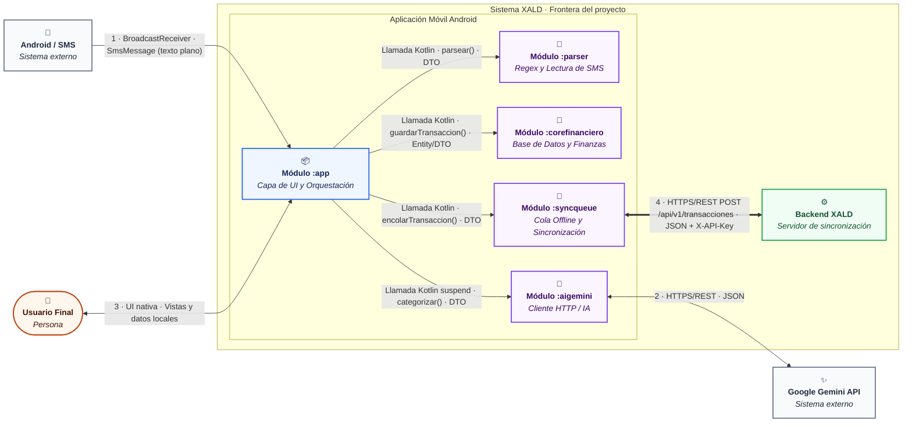

## C2 - Container

### Leyenda (C2 - Componentes)

**Tipos de elemento**

| Color | Tipo | Significado |
|---|---|---|
| Naranja | Persona | Actor humano que interactúa con el sistema |
| Azul | Sistema central | Módulo `:app` (Capa de UI y Orquestación), núcleo de la aplicación móvil |
| Morado | Módulo interno | Submódulos de la arquitectura modular (`:parser`, `:corefinanciero`, `:syncqueue`, `:aigemini`) |
| Verde | Servidor interno | Backend XALD (Servidor de sincronización), dentro de la frontera del proyecto |
| Gris | Sistema externo | Servicios o sistemas fuera del control del equipo (Android / SMS y Google Gemini API) |

**Tipos de relación**

| Notación | Significado |
|---|---|
| `-->` | Comunicación y llamada unidireccional |
| `<-->` | Comunicación bidireccional estándar |
| `<==>` | Canal de sincronización REST |

### Descripción de Conectores y Flujo de Interacción

1. **1 · Notificación SMS** (Android / SMS → Módulo `:app`): protocolo `BroadcastReceiver` de Android; formato `SmsMessage` en texto plano.
2. **2 · Inferencia / JSON** (Módulo `:aigemini` ↔ Google Gemini API): protocolo HTTPS/REST; formato JSON en ambas direcciones (texto del comercio → categoría normalizada).
3. **3 · UI / Reportes** (Usuario Final ↔ Módulo `:app`): interacción local mediante UI nativa; formato de vistas y datos locales del dispositivo, sin protocolo de red.
4. **4 · Sincronización REST** (Módulo `:syncqueue` ⇔ Backend XALD): protocolo HTTPS/REST, endpoint `POST /api/v1/transacciones` (ver `docs/api/openapi.yaml` y `docs/api/contrato.md`); formato JSON, autenticado con cabecera `X-API-Key`.
5. **Orquestación interna** (Módulo `:app` hacia submódulos): llamadas Kotlin directas en el mismo proceso, sin protocolo de red; el formato intercambiado son DTOs/objetos Kotlin (heredado de `c3.md`):
   - **Parser** → `parsear()`, recibe el texto crudo y devuelve monto/comercio.
   - **Corefinanciero** → `guardarTransaccion()`, persiste el DTO como entidad.
   - **Syncqueue** → `encolarTransaccion()`, encola el DTO pendiente.
   - **Aigemini** → `categorizar()` (`suspend`), pide la categoría del comercio.
