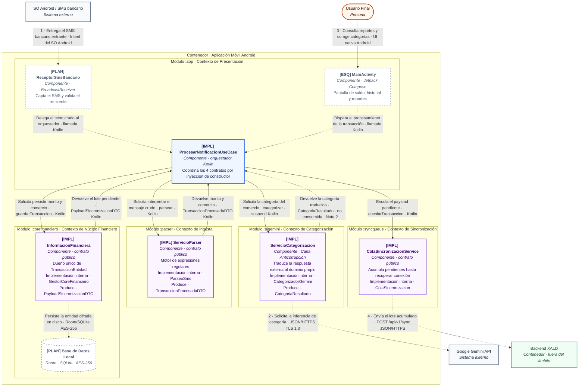

## C3 - Component

| | |
|---|---|
| **Diagrama** | C4 Nivel 3 — Componentes |
| **Ámbito** | Contenedor *Aplicación Móvil Android*, declarado en el [C2](c2.md) |
| **Proyecto** | XALD · Arquitectura de Software · Segundo corte |
| **Versión** | 1.0 |
| **Fecha** | 13 de septiembre de 2026 |
| **Responsable** | Axel Jair Ruiz Bolaño |
| **Validado contra** | rama `experimental` · 5 módulos Gradle de `settings.gradle.kts` |

Este diagrama abre uno de los dos contenedores declarados en el C2 —la Aplicación Móvil Android— y
muestra los componentes que lo forman. Cada componente se identifica por el contrato público que
expone; la implementación interna y los objetos de datos que produce se indican dentro de la misma
caja, porque pertenecen al nivel de código y no constituyen componentes por sí mismos. El *Backend
XALD* es el otro contenedor del sistema y aquí se representa sin descomponer.

Cada componente lleva un prefijo de estado, legible también en impresión monocroma:
`[IMPL]` implementado · `[ESQ]` esqueleto generado · `[PLAN]` planeado, aún sin código.

### Leyenda (C3 - Componentes)

**Tipos de elemento**

| Color | Borde | Tipo | Significado |
|---|---|---|---|
| Naranja | continuo | Persona | Actor humano que interactúa con el sistema |
| Azul | continuo | Orquestador | Componente de la capa de aplicación que coordina los contratos de dominio |
| Morado | continuo | Componente de dominio | Contrato público de un contexto delimitado, con su implementación interna |
| Blanco | punteado | Componente planeado | Diseñado y documentado, todavía sin código en el repositorio |
| Verde | continuo | Contenedor interno | Backend XALD, fuera del ámbito de este diagrama |
| Gris | continuo | Sistema externo | Servicio o plataforma fuera del control del equipo |

**Tipos de relación**

| Notación | Significado |
|---|---|
| `-->` | Llamada implementada en el código fuente del repositorio |
| `-.->` | Relación diseñada, pendiente de implementación |
| Etiqueta numerada | Conector heredado del [C1](c1.md) y del [C2](c2.md), con su propósito y su tecnología |
| Etiqueta sin número | Llamada interna al contenedor, con su propósito y su tecnología |

**Prefijos de estado**

| Prefijo | Significado |
|---|---|
| `[IMPL]` | Implementado y presente en el código de la rama `experimental` |
| `[ESQ]` | Archivo generado por Android Studio, sin lógica propia todavía |
| `[PLAN]` | Documentado y diseñado, sin código escrito |

### Descripción de Conectores y Flujo de Interacción

**Conectores heredados del C1 y del C2**

| # | Conector | Propósito y tecnología | Estado | Decisión que lo sustenta |
|---|---|---|---|---|
| 1 | SO Android → `ReceptorSmsBancario` | Recepción pasiva del SMS mediante `BroadcastReceiver`; requiere el permiso `RECEIVE_SMS`, aún no declarado en el manifiesto | Planeado | [ADR-0002](../adr/0002-parsing-hibrido.md) · [ADR-0003](../adr/0003-restriccion-os.md) |
| 2 | `ServicioCategorizacion` → Gemini API | Consulta HTTPS con el nombre del comercio y el monto, sin datos identificables del usuario | Planeado | [ADR-0002](../adr/0002-parsing-hibrido.md) · [ADR-0004](../adr/0004-seguridad-y-cifrado.md) |
| 3 | Usuario Final → `MainActivity` | Visualización de saldo y corrección manual de categorías sobre UI nativa | Planeado | [ADR-0005](../adr/0005-reduccion-de-funcionalidades.md) |
| 4 | `ColaSincronizacionService` → Backend XALD | Envío del lote acumulado al endpoint `POST /api/v1/sync`, ya existente en `backend_xald/index.js`; falta el cliente HTTP del lado de la app | Planeado | [ADR-0001](../adr/0001-patron-offline-first.md) |

**Flujo interno del contenedor**

| # | Relación | Propósito y tecnología | Estado | Decisión que lo sustenta |
|---|---|---|---|---|
| 5 | `ProcesarNotificacionUseCase` → `ServicioParser` | Invoca `parsear` sobre el texto crudo y recibe monto y comercio; la implementación `ParseoSms` permanece `internal` | Implementado | [ADR-0006](../adr/0006-seleccion-de-estilo-arquitectonico.md) |
| 6 | `ProcesarNotificacionUseCase` → `ServicioCategorizacion` | Invocación `suspend` a `categorizar`; la Capa Anticorrupción impide que tipos propios de Gemini crucen la frontera del módulo | Implementado | [ADR-0002](../adr/0002-parsing-hibrido.md) |
| 7 | `ProcesarNotificacionUseCase` → `InformacionFinanciera` | `guardarTransaccion` genera el identificador UUID y almacena la `TransaccionEntidad`; ningún otro componente escribe esta entidad | Implementado | [ADR-0001](../adr/0001-patron-offline-first.md) |
| 8 | `InformacionFinanciera` → `ProcesarNotificacionUseCase` | `obtenerPendientesSincronizacion` expone los pendientes como DTO de solo lectura, sin revelar la entidad ni el esquema de la base de datos | Implementado | [ADR-0006](../adr/0006-seleccion-de-estilo-arquitectonico.md) |
| 9 | `ProcesarNotificacionUseCase` → `ColaSincronizacionService` | `encolarTransaccion` acumula el payload a la espera de conexión | Implementado | [ADR-0001](../adr/0001-patron-offline-first.md) |

### Notas de alcance y coherencia

- **Nota 1 · Contratos y visibilidad.** Los cuatro componentes de dominio exponen únicamente una interfaz pública y una función fábrica; sus implementaciones (`ParseoSms`, `CategorizadorGemini`, `GestorCoreFinanciero`, `ColaSincronizacion`) están declaradas `internal`, de modo que el compilador de Kotlin impide que `:app` las referencie directamente. El aislamiento se verifica de forma automatizada en `ValidacionModulosTest`, que recorre el código fuente y falla si aparece una importación cruzada entre módulos.
- **Nota 2 · Deuda técnica detectada en esta revisión.** `ProcesarNotificacionUseCase` invoca `categorizar` pero descarta el `CategoriaResultado`: ni `guardarTransaccion` ni `TransaccionEntidad` admiten hoy un campo de categoría. La categoría inferida no llega a persistirse, y la categoría temporal *Sin Categorizar* prevista en ESC-02 no tiene dónde almacenarse. Corregirlo exige ampliar la firma del contrato y la entidad; queda propuesto para la sección 11 de arc42.
- **Nota 3 · Estado de la persistencia.** `InformacionFinanciera` y `ColaSincronizacionService` almacenan hoy en colecciones en memoria. El cifrado AES-256 y el Android Keystore previstos en [ADR-0004](../adr/0004-seguridad-y-cifrado.md) y en la restricción RT-03 todavía no están implementados, por lo que la base de datos local aparece con borde punteado.
- **Nota 4 · Coherencia entre niveles.** Los cinco módulos de este diagrama corresponden uno a uno con los cinco módulos del C2 y con los cinco proyectos incluidos en `settings.gradle.kts`. El conector 1 se dirige al módulo `:app`, tal como lo declara el C2.
- **Nota 5 · Discrepancia abierta sobre el conector 1.** La sección 8 de arc42 asigna el contexto de Ingesta al módulo `:parser`, lo que ubicaría allí el `ReceptorSmsBancario`. El C2 vigente dirige el conector 1 al módulo `:app`. Este diagrama respeta el C2 para no introducir piezas ajenas al nivel superior; la ubicación definitiva del receptor debe resolverse en el ADR del reajuste de límites y propagarse a ambos niveles.
- **Nota 6 · Cobertura de pruebas del orquestador.** `CorteVerticalTest` valida los cuatro contratos públicos invocándolos de forma consecutiva, pero no instancia `ProcesarNotificacionUseCase`. Las relaciones 5 a 9 están implementadas en el código y todavía no cubiertas por una prueba que ejercite el orquestador completo.
- **Nota 7 · Ámbito.** El Backend XALD se descompondría en su propio diagrama de nivel 3; aquí se mantiene como caja cerrada por tratarse de un contenedor distinto.
