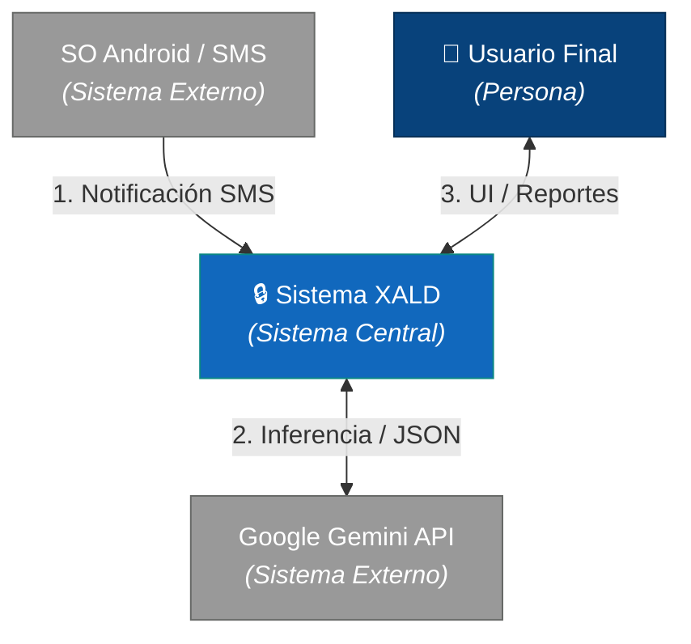

# C4 Model

## Overview
The C4 model is a hierarchical approach to documenting software architecture through four levels of abstraction:

- **C1 - Context**: System overview and its interactions with external systems/users

- **C2 - Container**: Major technical components and their relationships
- **C3 - Component**: Detailed breakdown of containers and internal structure
- **C4 - Code**: Low-level code structure and implementation details

## Purpose
Provides a clear, scalable way to communicate architecture to different stakeholders at varying levels of detail. x
