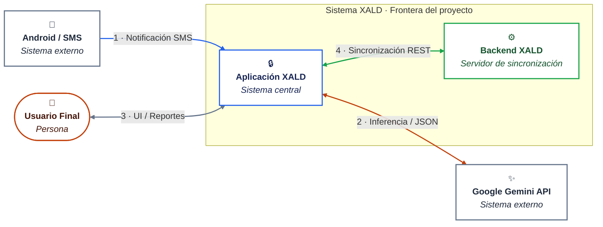

# C4 Model

## Overview

The C4 model is a hierarchical approach to documenting software architecture through four levels of abstraction:

- **C1 - Context**: System overview and its interactions with external systems/users



### Leyenda

**Tipos de elemento**

| Color | Tipo | Significado |
|---|---|---|
| Naranja | Persona | Actor humano que interactúa con el sistema |
| Azul | Sistema central | Aplicación móvil, núcleo del proyecto |
| Verde | Servidor interno | Backend de sincronización, dentro de la frontera del sistema |
| Gris | Sistema externo | Servicio de terceros, fuera del control del equipo |

**Tipos de relación**

| Notación | Significado |
|---|---|
| `-->` | Comunicación unidireccional |
| `<-->` | Comunicación bidireccional |
| Etiqueta numerada | Orden de la interacción dentro del flujo, seguido del protocolo o medio |

### Descripción de Conectores y Flujo de Interacción

1. **Notificación SMS** (SO Android → Aplicación XALD): Canal unidireccional por el cual el sistema operativo entrega el texto plano de la transacción financiera al detector interno del sistema.
2. **Inferencia / JSON** (Aplicación XALD ↔ Google Gemini API): Protocolo de comunicación HTTPS/REST donde XALD envía cadenas de comercios no reconocidos y recibe la categorización normalizada.
3. **UI / Reportes** (Usuario Final ↔ Aplicación XALD): Interfaz gráfica interactiva donde el usuario consulta sus finanzas locales y realiza ajustes directos.
4. **Sincronización / REST** (Aplicación XALD ↔ Backend XALD): Envío de las transacciones pendientes y recepción de los cambios remotos cuando hay conexión disponible.

### Notas de alcance

- El **Backend XALD** se representa dentro de la frontera del sistema porque está dentro del alcance del proyecto; su función se limita a sincronización y persistencia de transacciones.
- La **API de Gemini** se representa como sistema externo y su indisponibilidad no interrumpe el registro de transacciones (ver ESC-02).

## Otros niveles del modelo

- **C2 - Container**: Major technical components and their relationships
- **C3 - Component**: Detailed breakdown of containers and internal structure
- **C4 - Code**: Low-level code structure and implementation details

## Purpose

Provides a clear, scalable way to communicate architecture to different stakeholders at varying levels of detail.


## C2 - Container

Este nivel describe los contenedores (aplicaciones, servicios y bases de datos) que componen el sistema, cómo se despliegan y cómo se comunican entre sí. El diagrama y la leyenda a continuación se han completado con decisiones clave y una leyenda técnica mínima necesaria para un proyecto universitario.


### Leyenda (C2)

**Tipos de contenedor / elemento**

| Color / Tono | Tipo | Significado |
|---|---|---|
| Azul índigo | Receptor de Sistema | Componente nativo de interceptación (`SMSReceiver` / `BroadcastReceiver`) |
| Naranja oscuro | Persona | Actor humano que interactúa con el sistema |
| Azul oscuro | Sistema central (`:app`) | Capa de UI y orquestación, núcleo de la aplicación móvil |
| Morado oscuro | Módulo interno | Submódulos (`:parser`, `:corefinanciero`, `:syncqueue`, `:aigemini`) |
| Verde oscuro | Servidor interno | Backend de sincronización dentro de la frontera del proyecto |
| Gris pizarra | Sistema externo | Servicios o APIs de terceros fuera del control del equipo |

**Tipos de relación / protocolos**

| Notación | Significado |
|---|---|
| `-->` | Comunicación unidireccional |
| `<-->` | Comunicación bidireccional |
| `REST / HTTPS` | API entre cliente y backend |
| `SQLite / Local` | Persistencia local en el dispositivo |
| `Worker / Background` | Tareas en segundo plano que encolan y envían datos |

### Descripción de contenedores y responsabilidades

- Aplicación XALD (UI / Detector / Almacenamiento / SyncClient / InferenceClient)
  - UI / Interfaz: Presenta informes, permite correcciones manuales y configura preferencias.
  - Detector SMS: Servicio responsable de recibir notificaciones SMS del SO, parsear texto y extraer transacciones.
  - Almacenamiento local: Base de datos embebida (SQLite/Room) para persistencia offline y velocidad de lectura.
  - Cliente de Sincronización: Worker que gestiona cola local, reintentos y envío de cambios al Backend XALD cuando hay conexión.
  - Cliente de Inferencia: Encapsula llamadas a Google Gemini para normalización/categorización de comercios — diseño tolerante a fallos.

- Backend XALD (API / Auth / SyncService / DB / Admin)
  - API REST: Punto central para sincronización, autenticación y exposición de datos a clientes.
  - Servicio de Autenticación: Emite y valida tokens (JWT/OAuth) y gestiona sesiones.
  - Servicio de Sincronización: Asegura conciliación entre cambios locales y estado central, resolución de conflictos y entregas push si aplica.
  - Base de Datos: Almacena transacciones, usuarios y metadatos; diseñado para consistencia y respaldos.
  - Panel de Administración: Herramienta interna para inspección, corrección manual y métricas.

- Google Gemini API
  - Servicio externo para inferencia y categorización. Usado por la Aplicación XALD para enriquecer y normalizar datos.

### Flujos principales (resumen)

1. El SO entrega SMS al Detector, que extrae la transacción y la guarda en el Almacenamiento Local.
2. El Detector solicita (opcional) categorización a Gemini a través del Cliente de Inferencia.
3. El Usuario ve y edita transacciones en la UI; los cambios se guardan localmente.
4. El Cliente de Sincronización envía cambios a la API REST cuando hay conexión; el Backend aplica, persiste y replica cambios a la DB.
5. El Backend coordina sincronizaciones entre múltiples dispositivos del mismo usuario y expone operaciones administrativas.

### Consideraciones de diseño y alcance

- La Aplicación XALD debe ser tolerante a la latencia o indisponibilidad de Gemini: la persistencia local nunca depende de una respuesta inmediata.
- El SyncClient implementa reintentos exponenciales y un modelo de conciliación (Last-Writer-Wins con timestamps y client_id) adecuado para el alcance del proyecto.
- Autenticación y autorización se realizan en el Backend; el cliente solo almacena tokens de corta duración y refresco seguro.
- La Base de Datos central es la fuente de verdad; los contenedores en el dispositivo son caches y zonas de trabajo offline.

---

A continuación se añaden los mínimos prácticos para C2: decisiones clave y la leyenda técnica, sin exagerar.

### Decisiones clave (C2)

- Modelo de sincronización: Last-Writer-Wins (LWW) con timestamps y client_id. Razonamiento: simple de implementar y suficiente para el alcance universitario. En conflictos críticos el admin puede corregir desde el panel.
- Persistencia local: SQLite/Room por defecto; evita dependencias externas.
- Comportamiento offline: persistir la transacción localmente con estado `pending`; SyncClient procesa la `sync queue` en segundo plano y marca `synced`/`failed`.
- Inferencia (Gemini): asíncrona y opcional: no bloquear la persistencia. Campos sugeridos: `inferredCategory`, `inferenceStatus` (pending/ok/error) y `inferenceConfidence`.
- API mínima: un endpoint `/sync` que acepte operaciones idempotentes (upsert/delete) con metadata { client_id, op_id, timestamp, payload }.

Ejemplo de payload (compacto):

```json
{
  "client_id": "device-abc-123",
  "op_id": "op-0001",
  "timestamp": "2026-08-30T12:34:56Z",
  "op": "upsert",
  "transaction": {
    "id": "tx-uuid-1",
    "amount": 1250,
    "merchant": "TIENDA XYZ",
    "currency": "ARS",
    "updated_at": "2026-08-30T12:34:56Z"
  }
}
```

- Seguridad mínima: HTTPS obligatorio; autenticación con JWT (access token corto) y endpoint `/auth/refresh` para refresh tokens. No enviar PII a Gemini sin anonimizar; en desarrollo las claves pueden estar en `local.properties` (NO commitear), en producción usar Android Keystore o delegar inferencia al backend.
- Observabilidad mínima: registrar fallos de sincronización y tamaño de la cola pendiente; métricas simples para reintentos y latencias de Gemini.

(Continúa con C3 y C4 en secciones separadas según corresponda.)
