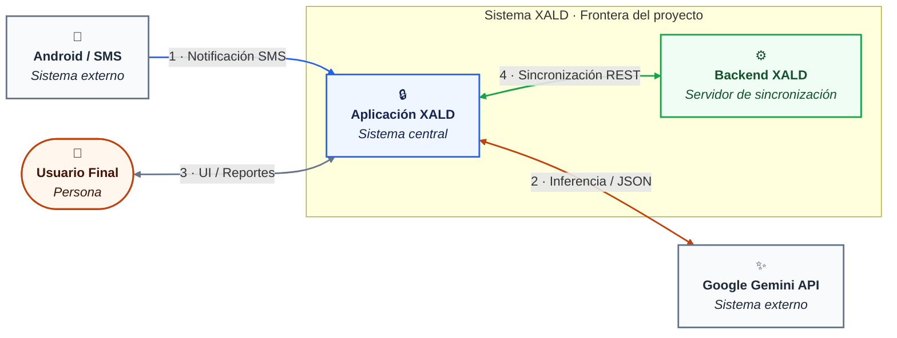
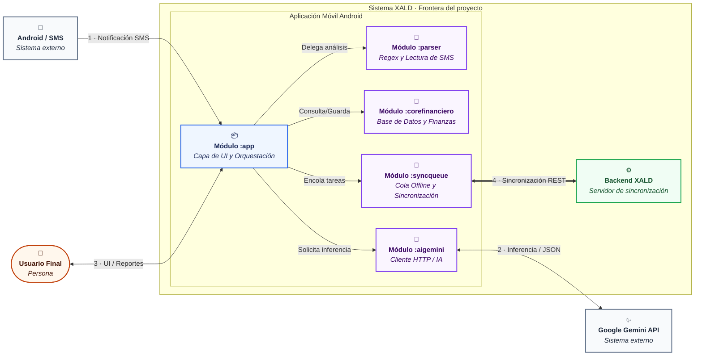

# C4 Model

## Overview

The C4 model is a hierarchical approach to documenting software architecture through four levels of abstraction:

- ## **C1 - Context**: System overview and its interactions with external systems/users

### Leyenda

**Tipos de elemento**

| Color | Tipo | Significado |
|---|---|---|
| Naranja | Persona | Actor humano que interactúa con el sistema |
| Azul | Sistema central | Aplicación móvil, núcleo del proyecto |
| Verde | Servidor interno | Backend de sincronización, dentro de la frontera del sistema |
| Gris | Sistema externo | Servicio de terceros, fuera del control del equipo |

**Tipos de relación**

| Notación | Significado |
|---|---|
| `-->` | Comunicación unidireccional |
| `<-->` | Comunicación bidireccional |
| Etiqueta numerada | Orden de la interacción dentro del flujo, seguido del protocolo o medio |

### Descripción de Conectores y Flujo de Interacción

1. **Notificación SMS** (SO Android → Aplicación XALD): Canal unidireccional por el cual el sistema operativo entrega el texto plano de la transacción financiera al detector interno del sistema.
2. **Inferencia / JSON** (Aplicación XALD ↔ Google Gemini API): Protocolo de comunicación HTTPS/REST donde XALD envía cadenas de comercios no reconocidos y recibe la categorización normalizada.
3. **UI / Reportes** (Usuario Final ↔ Aplicación XALD): Interfaz gráfica interactiva donde el usuario consulta sus finanzas locales y realiza ajustes directos.
4. **Sincronización / REST** (Aplicación XALD ↔ Backend XALD): Envío de las transacciones pendientes y recepción de los cambios remotos cuando hay conexión disponible.

### Notas de alcance

- El **Backend XALD** se representa dentro de la frontera del sistema porque está dentro del alcance del proyecto, en coherencia con la sección 3 del arc42. Su función se limita a sincronización y respaldo: la aplicación opera de forma completa sin él (ver ESC-01).
- La **API de Gemini** se representa como sistema externo y su indisponibilidad no interrumpe el registro de transacciones (ver ESC-02).

## Otros niveles del modelo

- ## **C2 - Container**: Major technical components and their relationships
  

### Leyenda

**Tipos de elemento**

| Color | Tipo | Significado |
|---|---|---|
| Naranja | Persona | Actor humano que interactúa con el sistema |
| Azul | Sistema central | Capa de UI y Orquestación, núcleo de la aplicación móvil |
| Morado | Módulo interno | Submódulos de la arquitectura modular (`:parser`, `:corefinanciero`, `:syncqueue`, `:aigemini`) |
| Verde | Servidor interno | Backend de sincronización dentro de la frontera del proyecto |
| Gris | Sistema externo | Servicios, dispositivos o APIs de terceros fuera del control del equipo |

**Tipos de relación**

| Notación | Significado |
|---|---|
| `-->` | Comunicación y llamada unidireccional |
| `<-->` | Comunicación bidireccional estándar |
| `<==>` | Canal de sincronización bidireccional por lotes o REST |
| Etiqueta descriptiva | Propósito, flujo de datos o acción ejecutada entre componentes |

### Descripción de Conectores y Flujo de Interacción

1. **Notificación SMS** (Android → Módulo `:app`): Canal por el cual el sistema operativo entrega el texto de la transacción financiera al núcleo de la aplicación.
2. **Delega análisis** (Módulo `:app` → Módulo `:parser`): Envío del texto al componente encargado de la lectura mediante expresiones regulares.
3. **Consulta/Guarda** (Módulo `:app` → Módulo `:corefinanciero`): Gestión de la base de datos y persistencia financiera local.
4. **Encola tareas** (Módulo `:app` → Módulo `:syncqueue`): Registro de operaciones en la cola offline para sincronización posterior.
5. **Solicita inferencia** (Módulo `:app` → Módulo `:aigemini`): Petición de normalización de comercios hacia el cliente de IA.
6. **Inferencia / JSON** (Módulo `:aigemini` ↔ Google Gemini API): Comunicación HTTPS/REST donde el cliente de IA envía datos y recibe la normalización de comercios.
7. **UI / Reportes** (Usuario Final ↔ Módulo `:app`): Interfaz interactiva para la visualización de finanzas locales y reportes de usuario.
8. **Sincronización REST** (Módulo `:syncqueue` ⇔ Backend XALD): Intercambio bidireccional para respaldar transacciones pendientes y sincronizar cambios remotos.

- ## **C3 - Component**: Detailed breakdown of containers and internal structure
- ## **C4 - Code**: Low-level code structure and implementation details

## Purpose

Provides a clear, scalable way to communicate architecture to different stakeholders at varying levels of detail.
