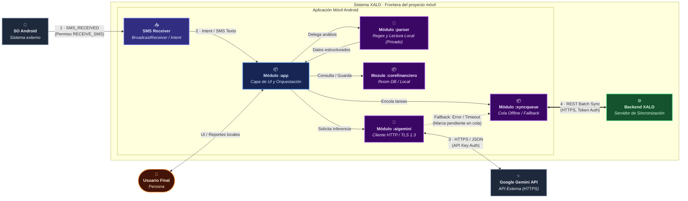

# C4 Model

## Overview

The C4 model is a hierarchical approach to documenting software architecture through four levels of abstraction:

- **C1 - Context**: System overview and its interactions with external systems/users

### Leyenda

**Tipos de elemento**

| Color | Tipo | Significado |
|---|---|---|
| Naranja | Persona | Actor humano que interactúa con el sistema |
| Azul | Sistema central | Aplicación móvil, núcleo del proyecto |
| Verde | Servidor interno | Backend de sincronización, dentro de la frontera del sistema |
| Gris | Sistema externo | Servicio de terceros, fuera del control del equipo |

**Tipos de relación**

| Notación | Significado |
|---|---|
| `-->` | Comunicación unidireccional |
| `<-->` | Comunicación bidireccional |
| Etiqueta numerada | Orden de la interacción dentro del flujo, seguido del protocolo o medio |

### Descripción de Conectores y Flujo de Interacción

1. **Notificación SMS** (SO Android → Aplicación XALD): Canal unidireccional por el cual el sistema operativo entrega el texto plano de la transacción financiera al detector interno del sistema.
2. **Inferencia / JSON** (Aplicación XALD ↔ Google Gemini API): Protocolo de comunicación HTTPS/REST donde XALD envía cadenas de comercios no reconocidos y recibe la categorización normalizada.
3. **UI / Reportes** (Usuario Final ↔ Aplicación XALD): Interfaz gráfica interactiva donde el usuario consulta sus finanzas locales y realiza ajustes directos.
4. **Sincronización / REST** (Aplicación XALD ↔ Backend XALD): Envío de las transacciones pendientes y recepción de los cambios remotos cuando hay conexión disponible.

### Notas de alcance

- El **Backend XALD** se representa dentro de la frontera del sistema porque está dentro del alcance del proyecto, en coherencia con la sección 3 del arc42. Su función se limita a sincronización y[...]
- La **API de Gemini** se representa como sistema externo y su indisponibilidad no interrumpe el registro de transacciones (ver ESC-02).

## Otros niveles del modelo

- **C2 - Container**: Major technical components and their relationships
- **C3 - Component**: Detailed breakdown of containers and internal structure
- **C4 - Code**: Low-level code structure and implementation details

## Purpose

Provides a clear, scalable way to communicate architecture to different stakeholders at varying levels of detail.

## C2 - Container

Este nivel describe los contenedores (aplicaciones, servicios y bases de datos) que componen el sistema, cómo se despliegan y cómo se comunican entre sí. El diagrama y la leyenda a continuación están alineados con el C1 y son fieles a la arquitectura del proyecto XALD.

(Continúa con C3 y C4 en secciones separadas según corresponda.)
